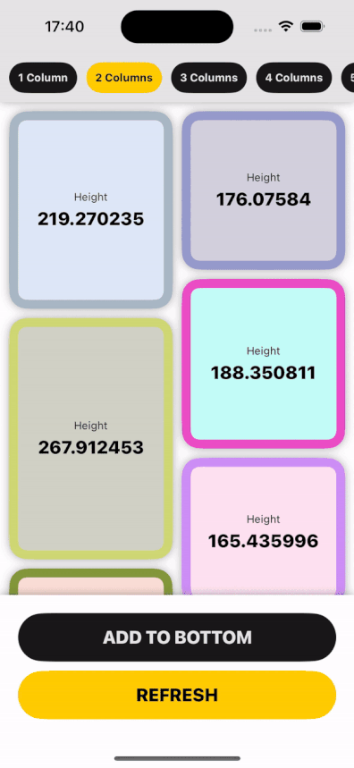

# CollectionUI

An example SwiftUI app that uses a `UICollectionViewController` to render a masonry layout.

## Motivation

While the masonry layout works well 🙌, the main reason for developing this project was to demonstrate interfacing with `UICollectionViewController` in a SwiftUI app. This is a useful (hybrid) option for when SwiftUI's stacks/grids/tables do not provide enough configuration.

It is worth mentioning that a pure SwiftUI solution should be attempted first. There are also other ways to specify the layout of a `UICollectionView`, this project's subclassing of `UICollectionViewLayout` may be a little on the old side, but gives the developer a lot of control. `UICollectionView`'s re-usable cells that only render when visible are definitely preferable to a SwiftUI solution that renders all when the data set is large.

## Notable Entities

The project is reasonably well documented, but here is a summary of the notable entities.

### MasonryColumns

Stores a 2D array of columns and their vertically stacked items. When a new item is going to be added, the last element of each column is compared to see which has the smallest `maxY`. The new item is then appended to the shortest column.

###  MasonryBuilder

Takes an array of models and computes their frames in the collection view. This structure performances the positional/size calculations.

### MasonryLayout

A `UICollectionViewLayout` subclass that overrides the necessary methods and serves the layout attributes.

### CollectionView

A `UIViewControllerRepresentable` that wraps a `UICollectionViewController` with a custom `MasonryLayout`. Cells are configured with SwiftUI's [UIHostingConfiguration](https://developer.apple.com/documentation/SwiftUI/UIHostingConfiguration).

### MasonryConfiguration

Properties that configure how the masonry layout will look in the `UICollectionView`. For example, padding, spacing, and number of columns.

### Manager

An example of an `@Observable` that loads models (via a dummy asynchronous load) for layout in the masonry.

### Model

A simple dummy model that is rendered as cells in the collection view. They each have a random (and then fixed) height to achieve the masonry design.